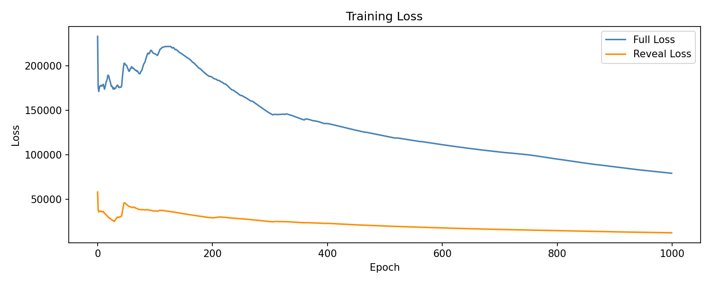
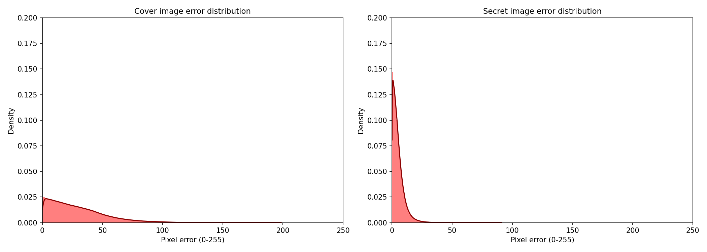
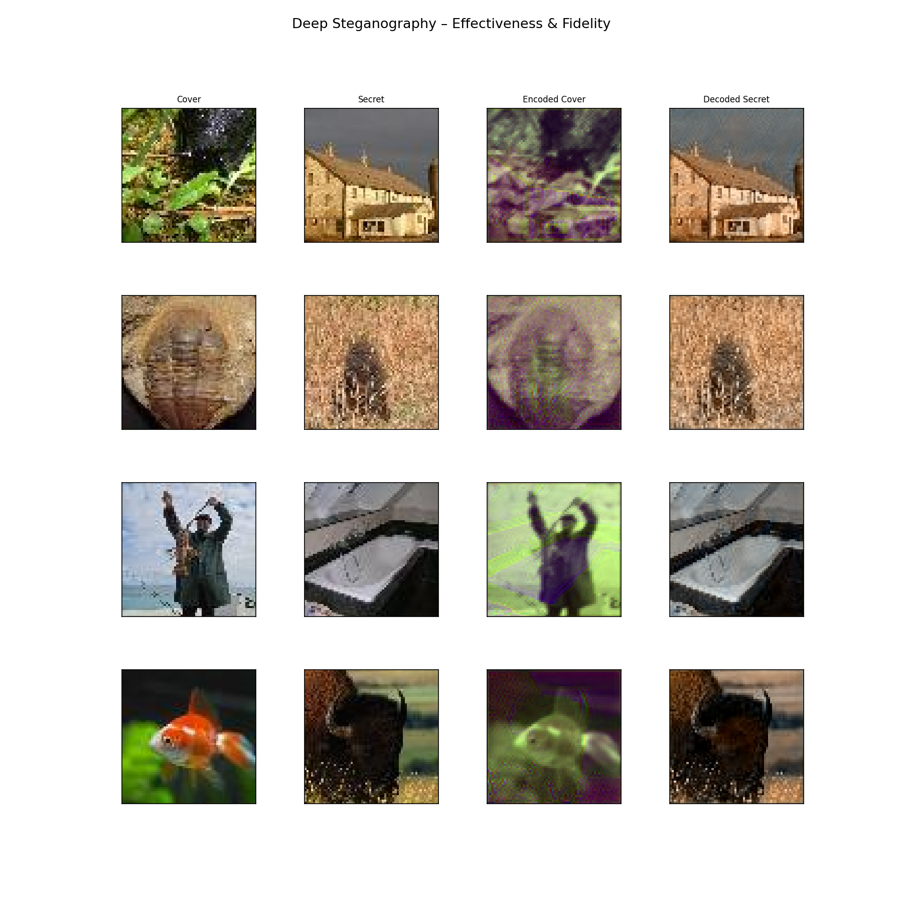

# Deep Image Steganography – Paper Replication

This repository contains a full replication of the deep image steganography model described in:

> *International Journal on Science and Technology (IJSAT), Volume 16, Issue 2, April–June 2025*

The project reproduces the encoder–decoder based deep steganography framework for hiding a secret image inside a cover image using convolutional neural networks.

---

## 📌 Project Overview

This work implements a deep learning–based image steganography system capable of:

- Embedding a secret image inside a cover image
- Generating a visually similar encoded (stego) image
- Recovering the hidden secret image via a decoder network
- Training using a joint loss (full loss + reveal loss)

This implementation is a **replication** of the original published architecture and training pipeline.

---

## ⚙️ Hardware & Environment

- GPU: **NVIDIA RTX 4050**
- Framework: TensorFlow 2.1x
- OS: Ubuntu (WSL2)
- CUDA Enabled

---

## 📂 Dataset

- Dataset: Tiny ImageNet-200
- Total images used for training: **1000**
  - 500 used as secret images
  - 500 used as cover images
- Total images used for testing: **1000**
  - 500 used as secret images
  - 500 used as cover images
- Image size: 64 × 64 × 3
- Preprocessing:
  - Resizing to 64x64
  - Normalization to [0, 1]

---

## 🏗️ Model Architecture

The model consists of:

### 🔹 Encoder (Prep & Hide Network)
- Multi-scale convolutional layers (3x3, 4x4, 5x5)
- Feature concatenation
- Produces encoded container image

### 🔹 Decoder (Reveal Network)
- Convolutional layers
- Gaussian noise injection (robustness)
- Recovers hidden secret image

### 🔹 Training Strategy
- Full loss (message + container reconstruction)
- Reveal loss (secret reconstruction)
- Learning rate scheduling
- Trained for **1000 epochs**

---

## 🚀 Training Details

- Epochs: **1000**
- Batch size: 32
- Optimizer: Adam
- Learning rate schedule applied
- GPU-accelerated training

---

## 📊 Results

### Final Metrics
- Secret RMSE : 11.4976
- Cover RMSE : 37.5712

These values indicate:

- Strong reconstruction accuracy of the secret image
- Acceptable distortion introduced into the cover image
- Stable convergence across training

---

## Evaluation Outputs

The loss curve demonstrates:

- Rapid initial reduction during early epochs
- Stable gradual convergence
- No divergence or instability
- Consistent optimization across 1000 epochs

The error distribution plots demonstrate:

- Strong concentration of pixel errors near zero
- Smooth right-skewed distribution indicating limited high-intensity deviations
- Lower reconstruction error for secret images compared to cover distortion
- Stable embedding behavior without extreme pixel corruption

The visual comparison grid demonstrates:

- High perceptual similarity between cover and encoded images
- Successful concealment without major structural artifacts
- Recognizable recovery of secret images after decoding
- Preservation of key spatial features in both embedding and extraction

---

## How To Run

To train and evaluate the model:
- python main.py
To evaluate using saved models only:
- python main.py --eval-only

## Notes

This project replicates the original published steganography model and verifies:

- Successful embedding of secret images
- Visual fidelity of encoded cover images
- Accurate recovery of secret images
- Stable large-scale training over 1000 epochs

#Future extensions may include:

- Robustness under JPEG compression
- Decoder fine-tuning under lossy transmission
- Compression-aware training
- Error-correction integration

---

Deep learning–based steganography replication completed successfully.